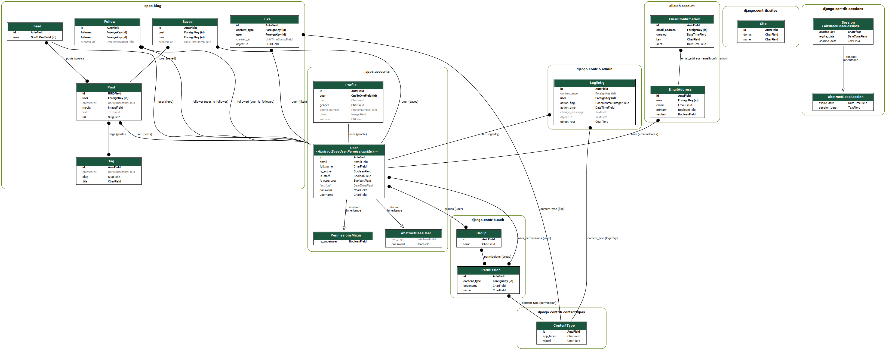

# Instacopy

## Используемый стэк технологий

Backend:
- Python >= 3.8
- Poetry = 0.1.0
- Django = 3.1.5
- PostgreSQL = 12.6

Frontend: 
- HTML5, CSS3, Bulma;
- Javascript, JQuery, AJAX;

Deployment:
- Docker = 20.10
- Gunicorn = 20.1.0
- Nginx = 1.19.3
- AWS


## Описание проекта

Данный pet-project представляет собой фотоблог с Instagram-подобным функционалом, реализованным с помощью Django.
Проект состоит из двух приложений: приложения, реализующего основной функционал блога, и приложения для работы с пользовательской аутентификацией.

## Состояние проекта

### На данный момент в проекте:

в приложении accounts
- созданы следующие модели:
    - расширена базовая модель пользователя django.contrib.auth.User;
    - модель пользовательского профиля Profile
- добавлена возможность самостоятельно редактировать настройки своего профиля;
- c помощью библиотеки django-allauth реализованы следующие сценарии аутентификации пользователя:
    - регистрация;
    - login;
    - logout;
    - восстановление пароля с помощью email;

в приложении blog
- созданы следующие модели:
    - пост Post;
    - тэг поста Tag;
    - пользовательская лента Feed;
    - лайк Like (c помощью встроенного в Django фреймворка contenttypes);
    - подписка Follow;
- реализованы сценарии для отображения блога пользователя, пользовательской ленты, детального вида поста, а также для списка постов,
 содержащих одинаковый тэг;
- реализованы сценарии пользовательских подписок, лайков и сохранения постов (c применением технологии AJAX);
- произведена обработка пользовательского доступа внутри представлений и шаблонов;

А также помощью системы сигналов реализованы следующие сценарии:
- при создании нового пользователя в БД создаются объекты пользовательского профиля, ленты и самоподписки для 
автоматического добавления собственных постов в ленту);
- при создании поста происходит парсинг тэгов из текста поста и создаются соответствующие им экземпляры моделей;
- при создании поста происходит автоматическое добавление поста в ленту фолловеров;
- при добавление / удалении подписки происходит автоматическое добавление / удаление постов из ленты фолловера;

Помимо этого в проекте:
- создана пользовательская manage.py-команда для создания тестовых экземпляров моделей приложений и заполнения ими 
пустых таблиц БД;
- произведена оптимизация запросов к базе внутри кода;

Итоговое приложение развернуто на AWS EC2 внутри Docker-контейнера, работает через прокси-сервер Nginx 
с автоматической настройкой SSL-сертификации через Let's Encrypt. Для обслуживания базы данных PostgreSQL 
используется AWS RDS, а для хранения и управления созданными Docker-контейнерами используется AWS ECR.


### TODO:

1. Реализовать следующий функционал:
    - удаление постов;
    - создание, редактирование и удаление комментариев;
    - вывод сохраненных постов внутри блога с помощью AJAX-запроса;
    - создание пагинации с помощью AJAX;
    - создание миниатюр файлов при загрузке постов;
    - возможность загрузки более чем одного вложения поста;
    - возможность загрузки и воспроизведения видео в качестве вложения поста;
    - обработка отложенных задач с помощью Celery;


2. Покрыть написанный код тестами;

### Cхема базы данных


## Установка, настройка и запуск проекта
- Создайте локально пустую директорию и инициализируйте в ней git-репозиторий:
```bash
mkdir instacopy
cd instacopy
git init
```
- Скопируйте репозиторий проекта в созданную директорию:
```bash
git clone https://github.com/romannovikov/instacopy-petproject.git
```
- Настройте и запустите проект с помощью docker-compose:
```bash
# сборка Docker-сервиса
sudo docker-compose build
# создание исходных таблиц в БД
sudo docker-compose run --rm app python manage.py makemigrations
sudo docker-compose run --rm app python manage.py migrate
# создание тестовых моделей и заполнение таблиц тестовыми данными
sudo docker-compose run --rm app python manage.py createinitialdata
# запуск Docker-сервиса
sudo docker-compose up -d
```
- В командной строке браузера перейдите по адресу http://0.0.0.0:8000/
